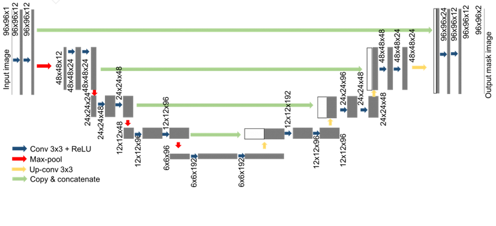
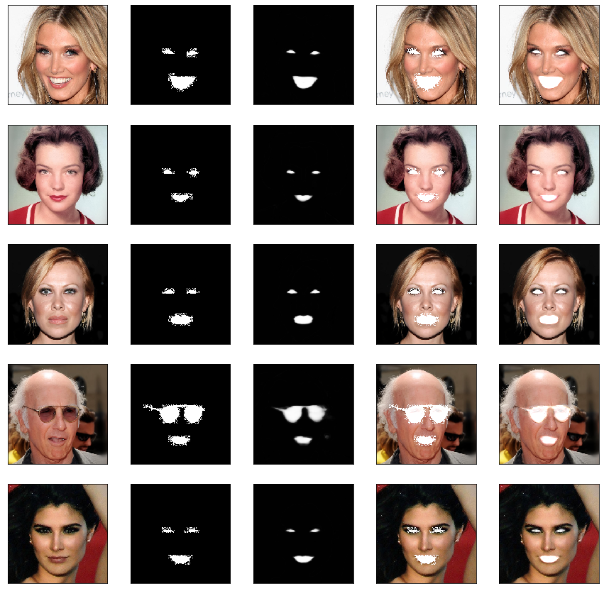

# Face(Eyes and Mouth) Segmentation
###### Dataset: Cheng-Han Lee et. al. "MaskGAN: Towards Diverse and Interactive Facial Image Manipulation", Github:https://github.com/switchablenorms/CelebAMask-HQ/blob/master/README.md

### Directory Description
- Notebook subdirectory contains two notebooks one named Exploratory Data Analysis.ipynnb for preprocessing(combining the masks and organizing them into a directory), analysis and other one named Eyes and Lips Segmentation.ipynb in which segmented is performed and results have been visualized
- weights subdirectory contains the trained weight for the used model
- in root directroy unet.png which is the architecture of unet(with little diff ), index.png is the visualized result and requirements.txt file contains the libraries required. 

### Requirements
- Python3.5
- Install the dependencies with command
  - pip install -r equirements.txt

#### UNet Architecture

#### Results
 &nbsp; &nbsp; &nbsp; &nbsp; &nbsp; &nbsp; &nbsp; Image &nbsp; &nbsp; &nbsp; &nbsp; &nbsp; &nbsp; &nbsp; &nbsp; &nbsp; &nbsp; &nbsp; &nbsp; &nbsp; &nbsp; &nbsp; &nbsp;  GT &nbsp; &nbsp; &nbsp; &nbsp; &nbsp; &nbsp; &nbsp; &nbsp; &nbsp; &nbsp; &nbsp; &nbsp; &nbsp; &nbsp; &nbsp; &nbsp; &nbsp; &nbsp; &nbsp; Pred &nbsp; &nbsp; &nbsp; &nbsp; &nbsp; &nbsp; &nbsp; &nbsp; &nbsp; &nbsp; &nbsp; &nbsp; &nbsp; &nbsp; SegwithGT &nbsp; &nbsp; &nbsp; &nbsp; &nbsp; &nbsp; &nbsp; &nbsp; &nbsp; &nbsp; SegwithPred

## Reference
- [0] Olaf Ronneberger et. al. "U-Net: Convolutional Networks for BiomedicalImage Segmentation"
- [1] Zongwei Zhou et. al. "UNet++: A Nested U-Net Architecturefor Medical Image Segmentation"
- [2] Liang-Chieh Chen et. al. "Encoder-Decoder with Atrous Separable Convolution for Semantic Image Segmentation"
